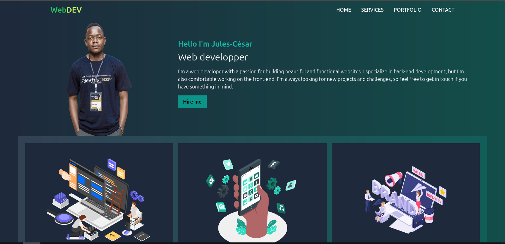

## WEB DEVELOPPER PORTFOLIO

## Usage

- Clone or download this repository
- Run `npx tailwindcss -i ./src/input.css -o ./src/output.css --watch`
- Open `src/index.html` in your browser

## Screenshot

## Demo

For the demo <a href="https://web-developper-portfolio.vercel.app/">click here</a>